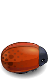

# Clasic Arcade Game Clone
### Screenshots
---------------------------

#### Characters
----------------------------

#### Bad enemy bugs
----------------------------
 
 
 

#### Extra points
---------------------------
 

 
 
 

#### 3 lifes
--------------------------
 lost 3 heart(gameover) 

#### Move!
-------------------------
![arrow keys] or [letter w,a,s,d] or [controls click on gamepad icon to show control]

#### How to play
----------------------------
- Choose your player
- Collect gems, keys and stars
- Avoid bugs
- Gems give you extra points
- Hearts give you extra lifes
- You win when you collect 50 (gems,keys,stars)

#### Acknowledgements
----------------------------
* [stackoverflow](https://stackoverflow.com/)
* [MDN web Doc Javascript](https://developer.mozilla.org/en-US/docs/Web/JavaScript) Reference website
* Character & game board sprites are from [PlanetCute Game Prototyping Tiles](http://www.lostgarden.com/2007/05/dancs-miraculously-flexible-game.html) by Daniel Cook
* Sounds are from [Sound Effects Library](https://www.zapsplat.com/sound-effect-category/game-sounds/)
* Blood splatters are from [pngtree](https://pngtree.com/freepng/crimson-blood_3448735.html)

